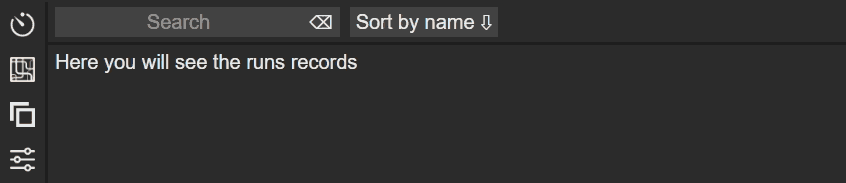
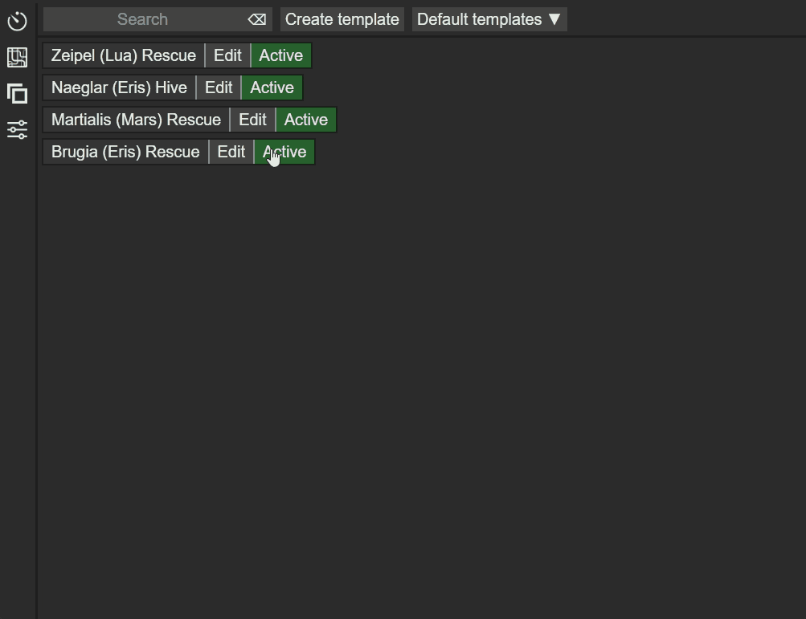
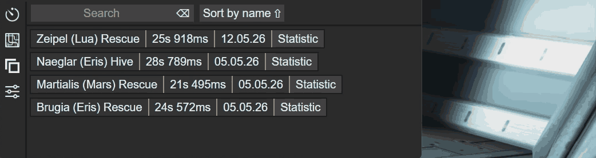
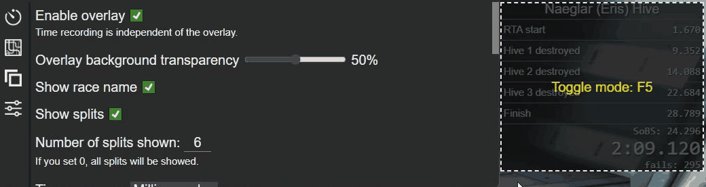
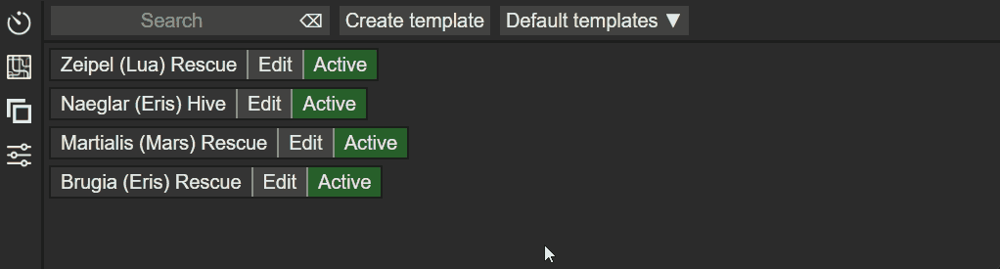
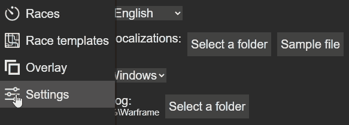

# WFAutoSplitter

**WFAutoSplitter** is an automatic run tracker and splitter for Warframe speedrunners.
It reads the game's log file in real time, detects run start, splits, and finish —
then saves everything to a local database for analysis.

## How It Works

The program monitors Warframe's log file and reacts to specific lines based on
user-defined **templates**. Each template describes the structure of a run:
mission start trigger, split points with custom names, and the finish condition.
Once a template is activated, WFAutoSplitter automatically tracks every run
that matches it.

## Features

- **Real-time log parsing** — detects run state instantly without any manual input
- **Custom templates** — flexible configuration of start, splits, and finish triggers
  for any mission or route
- **Millisecond precision** — timing accurate to milliseconds, unlike the in-game
  timer which only shows seconds
- **Load time removal** — option to exclude time spent between mission loads,
  so only actual gameplay time is counted
- **Trigger-only mode** — correctly measures run time even for missions where
  the in-game timer is not displayed
- **Run history** — every completed run is saved to a local database with full
  split data
- **Statistics & charts** — view your progress over time with run history and
  performance graphs
- **Overlay** — an optional always-on-top overlay displays current timer and
  split information during a run. The overlay is completely optional and does
  not affect run recording in any way
- **Disruption prediction** — for 45-round Disruption runs, predicts the estimated
  finish time based on current split pace
- **Multi-run total** — view the combined time of several recent runs, useful for
  events where the same mission is repeated back-to-back
- **Auto-update** — the app checks for new versions on startup and notifies you
  when an update is available

## Getting Started

1. Download the latest [installer](../../releases)
2. Install and launch WFAutoSplitter
3. In Race templates, create a template for the mission you need or select one from the default list, then activate it

Now, when completing missions based on active templates in Races, a race chart and history will be displayed, showing detailed information about split times sorted by time

In Overlay, you can enable and configure an overlay that displays information about the current race

By switching the overlay mode, you can drag and drop it anywhere

You can modify a template at any time, for example, rename or delete it. You can also delete, add, or rename splits and groups, as well as edit mission and split codes

In Settings, you can change the interface language, add a local translation of the interface, change the interface theme, or change the path to the folder containing the EE.log file if the current path is incorrect

## Contributing Translations

If you want to add a new interface language to this repository:

1. **Fork** this repository — click the "Fork" button in the top right corner of this page
2. In your fork, go to `src/locales/` and create a new file named by language code,
   for example `de.json` for Deutsch, `fr.json` for French
4. Copy the contents of [`en.json`](/src/locales/en.json) and translate all values (do not change the keys)
5. Submit a **Pull Request** to this repository with your changes

Languages for which no translation is currently available:
   - Deutsch (de),
   - Spanish (es),
   - French (fr),
   - Italian (it),
   - Japanese (ja),
   - Korean (ko),
   - Polish (pl),
   - Brazilian Portuguese (pt),
   - Thai (th),
   - Turkish (tr),
   - Simplified Chinese (zh),
   - Traditional Chinese (tc).